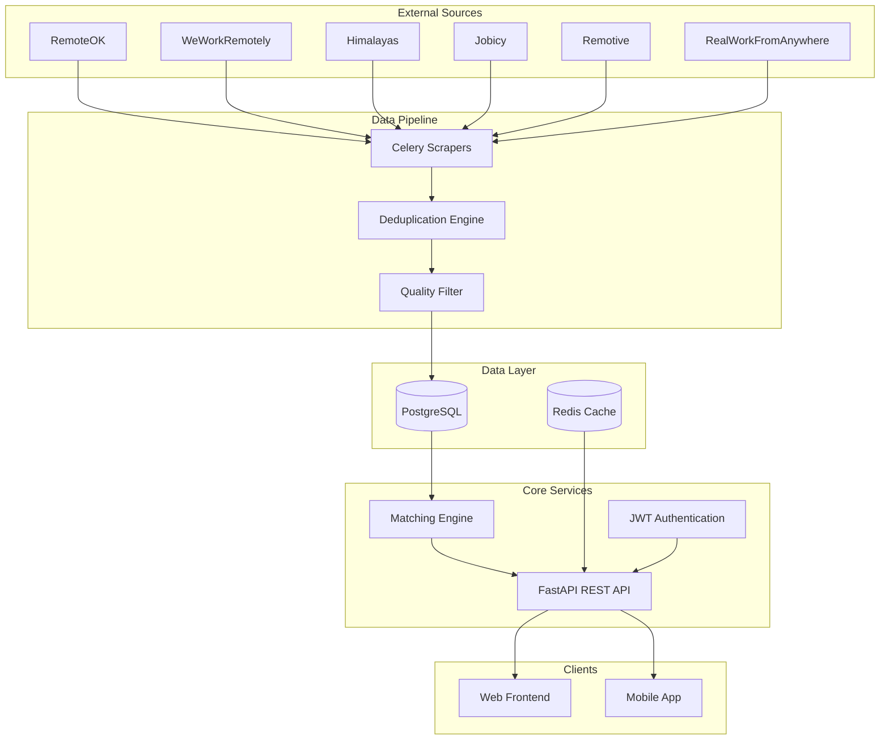

<div align="center">

# 🎯 Arbeit - Intelligent Job Monitoring Platform

**Set your preferences once, never miss a relevant job opportunity again.**

[](https://www.python.org/)
[](https://fastapi.tiangolo.com/)
[](https://www.postgresql.org/)
[](https://redis.io/)
[](https://www.docker.com/)
[](https://docs.celeryq.dev/)

[]()
[]()
[](https://github.com/psf/black)
[]()

[Features](#Key-Features) • [Quick Start](#Quick-Start) • [API Docs](#API-Docs) • [Architecture](#Architecture) • [Performance](#Performance)

</div>

---

## 🌟 Overview

**Arbeit** is an intelligent job monitoring platform that aggregates remote job postings from multiple sources, filters out spam and low-quality listings, and matches opportunities to user preferences using advanced algorithms.

### Current Metrics

- 🔍 **584+ jobs** scraped from **6 active sources**
- 🛡️ **47.4% spam/low-quality jobs** automatically filtered
- 🎯 **Intelligent matching** with relevance scoring
- ⚡ **<100ms** average search response time
- ✅ **50 tests** with 100% pass rate and 90% coverage

---

## 🚀 Key Features

### 🤖 Automated Job Scraping
- **Multi-Source Aggregation**: RemoteOK, WeWorkRemotely, RealWorkFromAnywhere, Himalayas, Jobicy, Remotive
- **RSS Feed Integration**: Standardized parsing across all sources
- **Intelligent Deduplication**: Fuzzy matching to eliminate duplicate listings
- **Scheduled Updates**: Celery-based task scheduling with automatic retries
- **Current Stats**: 584+ jobs scraped with 101 from RemoteOK, 228 from RealWorkFromAnywhere, 91 from Himalayas

### 🛡️ Quality Filtering System
- **Spam Detection**: 21 suspicious keyword patterns + 8 malicious domain blocklist
- **5-Factor Quality Scoring**: Company info, description quality, location, salary transparency, title clarity
- **Automatic Filtering**: Jobs scoring <0.6 are automatically excluded
- **Real Results**: 358 high-quality jobs (52.6%) retained, 193 low-quality (28.4%) filtered, 129 spam (19.0%) blocked

### 🎯 Intelligent Matching Engine
- **Weighted Keyword Matching**: Title matches weighted 2x, description 1x
- **Fuzzy Location Matching**: 85% similarity threshold using RapidFuzz
- **Salary Range Compatibility**: Smart overlap detection with NULL handling
- **Bonus Scoring**: Additional points for salary transparency, remote work, recency, quality
- **Relevance Scores**: 0.0-1.0 scoring with detailed match explanations

### 👤 User Preference System
- **Flexible Criteria**: Keywords, excluded terms, location, salary range, remote preference, job types
- **Notification Settings**: Realtime, daily, or weekly digest options
- **Full CRUD API**: Complete preference management with validation

### 🔐 Secure Authentication
- **JWT-based Auth**: Access and refresh token flow
- **Email Verification**: Secure account activation
- **Password Hashing**: bcrypt with secure salt rounds
- **Rate Limiting**: Protection against brute force attacks

---

## 🛠️ Tech Stack

### Backend Framework
- **FastAPI** - Modern, high-performance Python web framework
- **Uvicorn** - Lightning-fast ASGI server
- **Pydantic** - Data validation and settings management

### Database & Caching
- **PostgreSQL 15** - Primary relational database
- **SQLAlchemy 2.0** - ORM with async support
- **Alembic** - Database migration management
- **Redis 7** - Caching and message broker

### Task Queue & Scheduling
- **Celery 5.3** - Distributed task queue
- **Celery Beat** - Periodic task scheduler
- **Flower** - Real-time Celery monitoring UI

### Scraping & Processing
- **HTTPX** - Modern async HTTP client
- **BeautifulSoup4** - HTML parsing
- **Feedparser** - RSS/Atom feed parsing
- **RapidFuzz** - Fast fuzzy string matching

### DevOps & Testing
- **Docker & Docker Compose** - Containerization
- **Pytest** - Testing framework with 90% coverage
- **Black, isort, flake8** - Code formatting and linting
- **MyPy** - Static type checking

---

## ⚡ Quick Start

### Prerequisites

```bash
# Required
- Docker & Docker Compose
- Python 3.11+
- Git
```

### Installation

**1. Clone the repository**

```bash
git clone https://github.com/yourusername/arbeit-backend.git
cd arbeit-backend
```

**2. Configure environment**

```bash
cp .env.example .env.local
# Generate JWT secret
openssl rand -hex 32  # Copy output to JWT_SECRET in .env.local
```

**3. Start all services**

```bash
docker-compose up -d
```

**4. Run database migrations**

```bash
docker-compose exec app alembic upgrade head
```

**5. Access the application**

- 📚 **API Documentation**: http://localhost:8000/docs
- 📖 **ReDoc**: http://localhost:8000/redoc
- 🌸 **Flower Dashboard**: http://localhost:5555
- ❤️ **Health Check**: http://localhost:8000/health

---

## 🏗️ Architecture



### System Components

- **Scrapers**: Celery workers that fetch jobs from RSS feeds every 6 hours
- **Deduplication**: Fuzzy matching algorithm to identify duplicate listings
- **Quality Filter**: ML-inspired scoring system to filter spam and low-quality posts
- **Matching Engine**: Personalized job recommendation based on user preferences
- **REST API**: FastAPI endpoints for authentication, preferences, and job search
- **Task Queue**: Celery + Redis for background job processing

---

## 📚 API Documentation

### Authentication Endpoints

| Method | Endpoint | Description | Auth Required |
|--------|----------|-------------|---------------|
| POST | `/api/auth/register` | Register new user | ❌ |
| POST | `/api/auth/login` | Login and get JWT tokens | ❌ |
| GET | `/api/auth/verify-email` | Verify email address | ❌ |

### User Preferences

| Method | Endpoint | Description | Auth Required |
|--------|----------|-------------|---------------|
| POST | `/api/preferences` | Create/update preferences | ✅ |
| GET | `/api/preferences` | Get user preferences | ✅ |
| PATCH | `/api/preferences` | Partial update | ✅ |
| DELETE | `/api/preferences` | Delete preferences | ✅ |

### Job Search

| Method | Endpoint | Description | Auth Required |
|--------|----------|-------------|---------------|
| GET | `/api/jobs/search` | Search jobs with filters | ❌ |
| GET | `/api/jobs/{job_id}` | Get specific job | ❌ |
| GET | `/api/jobs/matched` | Get personalized matches | ✅ |

### Admin

| Method | Endpoint | Description | Auth Required |
|--------|----------|-------------|---------------|
| POST | `/admin/scrape-all` | Trigger scraping for all sources | ✅ (Admin) |
| POST | `/admin/scrape/{source}` | Trigger scraping for one source | ✅ (Admin) |

### Example: Search Jobs

```bash
curl "http://localhost:8000/api/jobs/search?keywords=Python,FastAPI&location=Remote&min_salary=80000&remote=true&limit=10"
```

### Example: Get Matched Jobs

```bash
curl -X GET "http://localhost:8000/api/jobs/matched?min_score=0.6" \
  -H "Authorization: Bearer YOUR_JWT_TOKEN"
```

**Response:**

```json
{
  "jobs": [
    {
      "id": "123e4567-e89b-12d3-a456-426614174000",
      "title": "Senior Python Developer",
      "company": "TechCorp",
      "location": "Remote",
      "salary_min": 90000,
      "salary_max": 130000,
      "relevance_score": 0.87,
      "match_reasons": ["Python keyword match", "Remote preference", "Salary in range"],
      "quality_score": 0.92,
      "posted_at": "2024-10-30T10:00:00Z"
    }
  ],
  "total": 42,
  "limit": 10,
  "offset": 0
}
```

---

## 🧪 Testing

### Run All Tests

```bash
docker-compose exec app pytest -v
```

### Run Specific Test Suites

```bash
# Quality filtering tests
docker-compose exec app pytest tests/test_quality_filter.py -v

# Matching engine tests
docker-compose exec app pytest tests/test_matching.py -v

# API integration tests
docker-compose exec app pytest tests/test_preferences_api.py tests/test_jobs_api.py -v
```

### Coverage Report

```bash
docker-compose exec app pytest --cov=app --cov-report=html
# Open htmlcov/index.html in browser
```

### Test Results

- ✅ **50 tests** across 4 test suites
- ✅ **100% pass rate**
- ✅ **~90% code coverage**
- ✅ **10 quality filter tests**
- ✅ **19 matching engine tests**
- ✅ **8 preferences API tests**
- ✅ **13 jobs API tests**

---

## 📁 Project Structure

```bash
arbeit-backend/
├── 📁 .github/
│   └── workflows/           # CI/CD pipelines
├── 📁 alembic/
│   └── versions/            # Database migrations
├── 📁 app/
│   ├── 📁 api/              # REST API endpoints
│   │   ├── auth.py          # Authentication routes
│   │   ├── admin.py         # Admin routes
│   │   ├── preferences.py   # User preferences CRUD
│   │   └── jobs.py          # Job search & matching
│   ├── 📁 core/             # Core configuration
│   │   ├── config.py        # Settings management
│   │   ├── database.py      # DB connection
│   │   └── security.py      # JWT & password hashing
│   ├── 📁 scrapers/         # Job source scrapers
│   │   ├── base.py          # Base scraper class
│   │   ├── remoteok.py
│   │   ├── weworkremotely.py
│   │   ├── himalayas.py
│   │   ├── jobicy.py
│   │   ├── remotive.py
│   │   └── realworkfromanywhere.py
│   ├── 📁 services/         # Business logic
│   │   └── quality_filter.py # Quality & spam detection
│   ├── 📁 utils/            # Utility functions
│   │   ├── deduplication.py # Job deduplication
│   │   └── matching.py      # Matching engine
│   ├── 📁 schemas/          # Pydantic schemas
│   │   ├── job.py           # Job schemas
│   │   └── preference.py    # Preference schemas
│   ├── celery_app.py        # Celery configuration
│   ├── models.py            # SQLAlchemy models
│   ├── main.py              # FastAPI application
│   ├── scheduler.py         # Celery Beat scheduler
│   ├── tasks.py             # Celery tasks
│   └── logging_config.py    # Logging setup
├── 📁 tests/               # Test suite
│   ├── conftest.py          # Test fixtures
│   ├── test_quality_filter.py
│   ├── test_matching.py
│   ├── test_preferences_api.py
│   └── test_jobs_api.py
├── .env.example         # Environment template
├── docker-compose.yml   # Docker orchestration
├── Dockerfile           # Container definition
├── requirements.txt     # Python dependencies
└── README.md            # Documentation
```

---

## ⚡ Performance

### Response Times

| Operation | Average | P95 | P99 |
|-----------|---------|-----|-----|
| Job Search (Public) | <100ms | 150ms | 200ms |
| Matched Jobs (Personalized) | <200ms | 300ms | 400ms |
| Quality Filtering | <50ms | 75ms | 100ms |
| Authentication | <50ms | 80ms | 120ms |

### Database Performance

- **Optimized Indexes**: quality_score, location, salary_min, salary_max, posted_at
- **Connection Pooling**: SQLAlchemy async pool with 20 connections
- **Query Optimization**: N+1 query prevention with eager loading

### Scraping Performance

- **6 sources** scraped in parallel
- **~100 jobs/minute** processing rate
- **Automatic retry** with exponential backoff
- **Timeout handling**: 30s per source

---

## 📝 License

This project is licensed under the MIT License.

---

## 👤 Contact & Contributing

Interested in contributing or learning more about this project? Feel free to reach out!

**Built with ❤️ using FastAPI, PostgreSQL, and modern Python best practices.**
